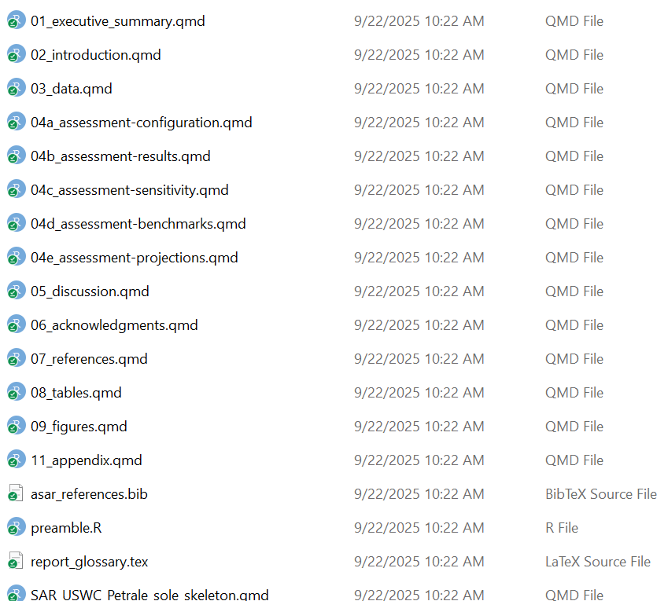
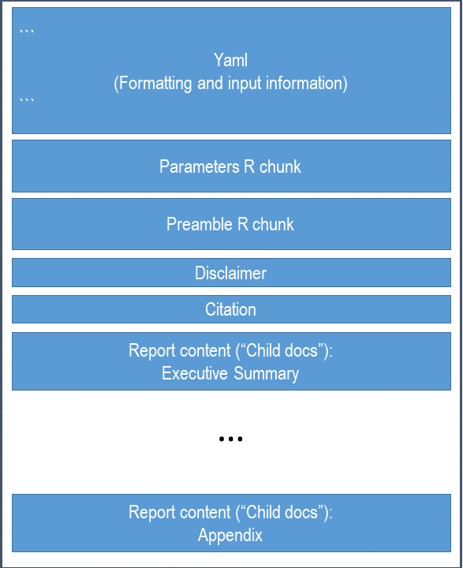
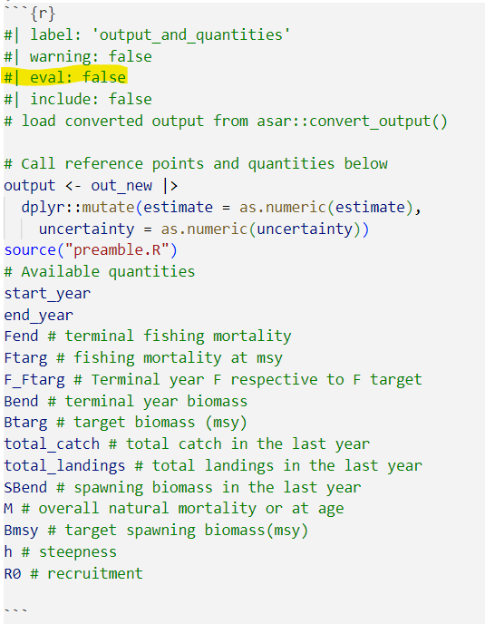

## Objectives

::: objectives
    -   Learn the basics of creating a stock assessment report using `asar`
    -   Understand the complexities and customization options of the package
    -   Provide time to practice and ask questions
:::

## Icebreaker

Welcome! Please open the [Day 2 communal notes doc](https://docs.google.com/document/d/1SY-xwHXnJUXSXTTeaPA_UkmXXVmUK9Ol751nh6Vtjmg/edit?tab=t.ds1fl2nu2oi5#heading=h.piviu2gu74mf) and participate in the icebreaker exercise.

Afterwards, we will use some time to answer any brief questionst lingering from yesterday.

::: {.callout-tip}
**Reminder**: For comments or questions, please raise your hand, or write them in the chat, *at any time*. Depending on our schedule, we may ask that you save larger questions for breaks.
:::

## asar

### Installation

Attendees of the workshop should have already downloaded this package during day 1. If you have not, please 
download `asar` through the following code:

```{r}
#| label: asar-download
#| eval: false
pak::pak("nmfs-ost/asar")
```

::: {.callout-note}
If you receive an error message when attempting the download the package, please ask the isntructor for 
alternative directions or see the README on the [`asar` repository](https://github.com/nmfs-ost/asar).
:::

### Getting Started

In this section we will cover the basics of `asar` by generating a blank stock assessement report and 
going through basic navigation of the template.

#### Recommended workflow

We *highly* recommend using a project based workflow meaning creating an R project for each report.
This makes returning to your session and maintaining files easier. Using either a project or GitHub
repository will help you in the long run.

To create a new R project in Rstudio:

File > New Project > New or Existing Directory

::: {.callout-important}
If you use VSCode or Positron for your IDE, by navigating to a folder on your computer, it will automatically initialize a project-like environment.
:::

#### Our Package

`asar` revolves around 4 primary functions, but contains a variety of support functions that help
make the template. While most of them are accessible to the user, they would not perform helpful
functions for them. We will be going over the following functions:

    -   `create_template()`
    -   `convert_output()`
    -   `create_tables_doc()`
    -   `create_figures_doc()`

##### `create_template`

**What it does:**

Generates a set of files that setup a stock assessment report with its supporting files.

Within the created files is the "skeleton file" which drives the render of the entire report. For those familiar
with Rmarkdown or Quarto books, this is operating similar to a .yml file. The other quarto files
found in your folder will be what we refer to as "child documents", or child docs for short. These
are the actual files that you will fill in when writing your report. These are the bulk of your content!

**Try it out!**

`create_template()` contains *A LOT* of arguments that allow the user to customize their document how
they want. The function contains a set of defaults that would produce a template that could be rendered,
but contains no real information relevant to the target stock.

So, let's do more than just create a blank template! The following arguments are some key parts to fill in for a specific stock assessment report:

| Argument | Options    |
|----------|------------|
| format   | pdf, html |
| type     | SAR, pfmc, safe |
| office   | afsc, pifsc, nefsc, nwfsc sefsc, swfsc |
| region   |  - |
| species  |  - |
| spp_latin | - |
| year | - |
| authors | - |
| file_dir | - |


```{r}
#| label: basic-ex
#| eval: false
# Adjust below example based on audience
library(asar)
library(here)
create_template(
  format = "pdf", # optional "html"
  type = "SAR", # add'l options: "safe", "nemt", "pfmc"
  office = "NWFSC",
  region = "U.S. West Coast",
  species = "Petrale sole",
  spp_latin = "Eopsetta jordani",
  authors = c("Samantha Schiano" = "OST"),
  file_dir = here::here()
)
```

**Run it!**

You should see a folder called "**report**" where you indicated in the argument `file_dir`. It
should have a set up that looks like this:



::: {.callout-note}
You should see a variety of messaged reported in the console to indicate
that it worked! For a blank template with no errors, it should look like this:


:::

##### Let's take a tour of the content we created!

**The Skeleton**



As previously mentioned, the skeleton file controls the rest of the report. This 
is the file you go to to compile your report, change formatting, or add quantities
to reference in your document.

We went over the basics of a Quarto yaml in Day 1, but when using asar, you don't actually have to fill in anything yourself. The beauty of using asar is that it removes this task, but filling out information provided in the `create_template()` arguments and providing the template custom formatting that is part of the package (and the NOAA standard!).


The YAML controls the following:

    - title
    - authorship
    - formatting
    - rendered file name
    - parameters
    - species cover image
    - bibliography
    - citation style

**Parameterization**

Quarto has a cool feature that allows users to parameterize their document by utilizing markdown's ability to render in-line code throughout your writing. In the yaml, there are pre-added parameters of the species, latin name, region, and office. These are called in through an R chunk after the YAML.

You have two options for calling these parameters in your writing.

    (1) \` r params$species \` (Quarto parameterization)
    (2) \` r species \` (asar use of parameterization)


**The Preamble**

The preamble is an R chunk that loads in a script called "preamble.R" which extracts key quantities commonly referenced in stock assessment reports. This will only work with a standard results file converted using `asar::convert_output()`, which we will get to shortly.



The quantities in found in this chunk can be referenced in-line throughout the document:

\` r R0 \`

::: {.callout-note}
For more information on markdown notation, see Day 1 of this workshop or navigate to [our article](https://nmfs-ost.github.io/asar/articles/markdown_notation.html) on the topic!
:::

**The Content**

The "child docs" are where you as the assessment author or contibutor report out the information you need to include. The template is highly modular so there are files for each section of the report and sometimes files for subsections. The default `asar` template creates child docs following the NOAA standard stock assessment report guidelines consisting of the following:

    - executive summary
    - introduction
    - data
    - assessment (modelling and results)
    - discussion
    - acknowledgements
    - references
    - tables
    - figures
    - appendix

Each child doc contains pre-determined headers and labels for the author to reference back to throughout the document. There are also descriptions within each section that depcit what you should report on throughout the document. You can either keep or remove these notes once the document is finished, either way, they will not be included in your final report.

Child docs are not intended to be rendered on their own, but only from the skeleton as a whole!

::: {.callout-important}
We are advising everyone that if required content is needed beyond the standard guidelines, that it gets placed in the appendix; however we encourage everyone to think about the importance of the content in terms of review for management versus CIE or SSC reveiw.
:::

**Demo of child docs**

### Break

**15 minute break**

##### `convert_output`

Another major component of `asar` is our converter function which converts an output file from a stock assessment model to a standard format which can be used by the preamble and our other package `stockplotr`. 

The `convert_output` function currently accepts output from Stock Synthesis (Report.sso) version 3.30 and higher, Beaufort Assessment Model (BAM; output.rda), or Fishereies Integrated Modelling System (FIMS; R object). We are actively working on expanding the `convert_output` function to be compatiable with all major U.S. stock assessment models. This function takes a lot of resources to develop, so any contribution to the package is welcome! If you have a model that is not currently compatible with `asar::convert_output()`, please navigate to [our article](https://nmfs-ost.github.io/asar/articles/convert_output_details.html) describing the function and how to get your output in the same format as those produced from the converter!

**Let's try it out!**

We have uploaded an example Report.sso file in the workshop GitHub, but if you have a compatible output file, we encourage you to use your own.

```{r}
#| label: conout-ex
#| eval: true
#| warning: false
#| messages: false
# Identify output file
output_file <- here("example_output", "Report.sso")
# convert the output
petrale <- convert_output(output_file)
```

```{r}
petrale
```

::: {.callout-tip}
`convert_output()` will recognize which model the results file came from as well as fleet names. In the rare case either of these are incorrect, the function contains arguments of `model` and `fleet_names` which you as the user can indicate for the function.

If you are explicitly stating fleet names, make sure they are in the order you expect them to be found in the file.
:::

##### `asar::create_tables_doc`

After running `create_template()`, a blank tables quarto file is created. It contains a statement to refer to {stockplotr} to add pre-made tables. You will learn more of that tomorrow, but for now we are going to go over how you add your own tables to the document.

Steps for adding a table:

    1. Create a code chunk
    2. Add your label and other options
    3. Add code
    4. Write caption

**Add a code chunk for each table**

```{verbatim}
```{r}
#| label: tbl-example
#| eval: false
#| echo: true
#| warning: false
#| tbl-cap: This is my caption for the example table.
flextable::flextable(petrale)
```
```

::: {.callout-tip}
It will be important to add your captions and labels into an excel file when making your documents accessible. You will learn more about this excel file and accessibility tomorrow!
:::

###### Non-code Tables

In the case you have made a table not using code, you can add it as an image. While this is not generally recommended since it significaly reduces the accessibility of your table, we understand that sometimes this is the only format you have it in.

Use the following notation to reference an external table as an image:

`{fig-alt="This is the alternative text for my table", #tbl-example}`

::: {.callout-note}
Notice how there is alternative text added to this method of adding a table. In this scenario, the table is recognized as an image and thus would NOT pass accessibility checks. Please make sure you add alternative text for tables added in this way.
:::

##### `asar::create_figures_doc`

Like with our tables file, a blank figures quarto file is created. It contains a statement to refer to {stockplotr} to add pre-made figures.

Steps for adding a figure:

    1. Create a code chunk
    2. Add your label and other options
    3. Add code
    4. Write caption and **alternative text**

[**Highlight the difference with a figure needing alternative text**]

**Add a code chunk for each table**

```{verbatim}
```{r}
#| label: tbl-example
#| eval: false
#| echo: true
#| warning: false
#| tbl-cap: This is my caption for the example table.
flextable::flextable(petrale)
```
```

::: {.callout-tip}
It will be important to add your captions and labels into an excel file when making your documents accessible. You will learn more about this excel file and accessibility tomorrow!
:::

###### Non-code Figures

Like tables, you can reference figures not made directly in code chunks. However, in this case, this does not change the accessibility of the figure as much because you as the user can still add the neccessary components to meet section 508 standards.

`{fig-alt="This is the alternative text for my figure", #fig-example}`

##### Referencing your tables or figures in text

Quarto uses a special notation to allow users to link tables and figures throughout their text. Use the following notation to link/reference tables in your text:

"@tbl-example" or "@fig-example"

By adding an @ symbol followed by the chunk label or just label of your table/figure will create an interactive link that lets the reader naviagte to that specific table/figure.

**Put it all together!**

Render your entire document and take a look at what we've made today.

## Questions

## Final Reminders

    - We will be holding office hours tomorrow 30 minutes before the next session starts for any questions.
    - Feel free to practice some more tonight and come tomorrow with any questions you may have.