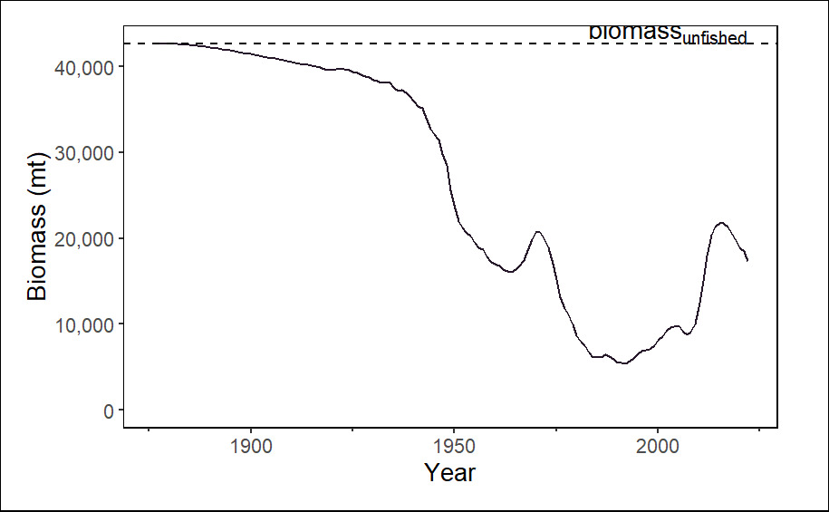
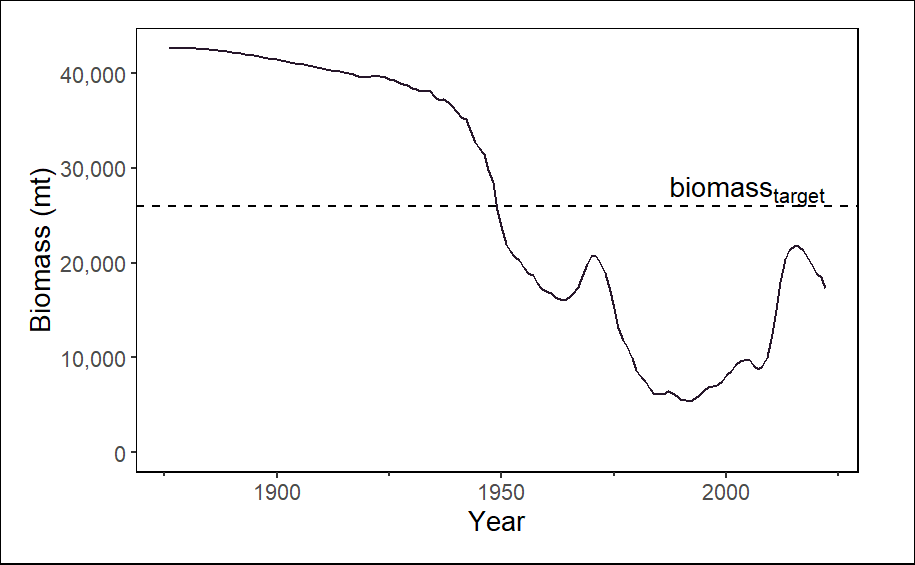
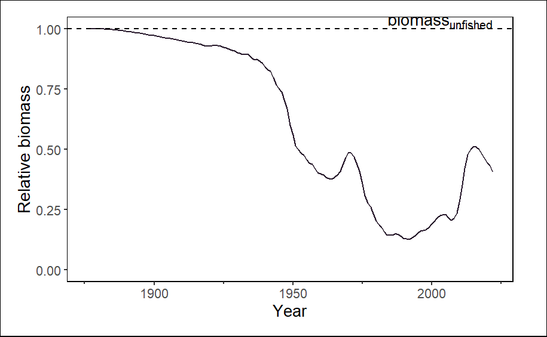
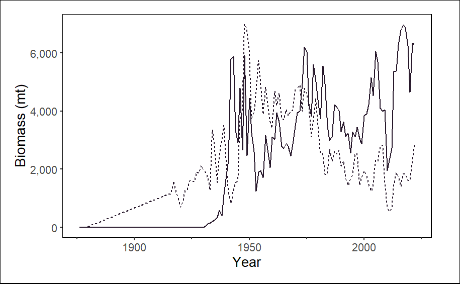
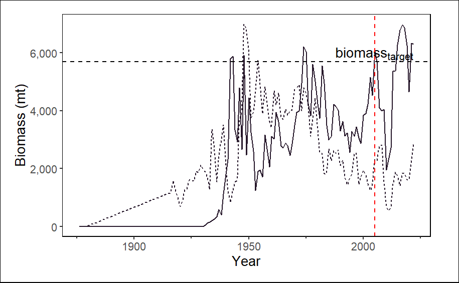

::: objectives
-   Work through a guided demo of a more complex `asar` workflow
-   Learn about the value of the `stockplotr` R package
-   Understand how to integrate `stockplotr` into an `asar`-based reporting workflow
-   Work through a guided demo of a basic `stockplotr` workflow
:::

# Introduction
## Icebreaker

Welcome! Please open the [Day 3 communal notes doc](https://docs.google.com/document/d/1SY-xwHXnJUXSXTTeaPA_UkmXXVmUK9Ol751nh6Vtjmg/edit?tab=t.vffehz79fm7y#heading=h.sfq3xaeehv64) and participate in the icebreaker exercise.

::: {.callout-tip}
**Reminder**: For comments or questions, please raise your hand, or write them in the chat, *at any time*. Depending on our schedule, we may ask that you save larger questions for breaks.
::: 

# Introduction to `stockplotr`

## Installation

::: {.callout-tip}
### Tip

The following packages are already installed in the `asar` workspace on JupyterHub, so if you are using that space, you can skip this section.
:::

```r
install.packages("pak")
pak::pak("nmfs-ost/asar")
pak::pak("nmfs-ost/stockplotr")
```

Please see the [`stockplotr` README](https://github.com/nmfs-ost/stockplotr) for more installation options.

## `stockplotr` workflow: Basic example

### Convert output (if necessary)

First, you'll need to convert your model results using the same workflow covered yesterday: `asar::convert_output()`.

You can use the example Report.sso file uploaded to the workshop GitHub or, if you have a compatible output file, your own.

```{r}
#| label: conout-ex
#| eval: false
#| warning: false
#| messages: false
# Identify output file
output_file <- here::here("example_output", "Report.sso")
# convert the output
petrale <- asar::convert_output(output_file)
```

If you have already converted your output: great! Import it into your R environment so that you can handle it as an object like "petrale" in the chunk above.

### Introduction to  `stockplotr`

This package is an ongoing process to gather contributions in order to expand the number of pre-made tables and figures that can be incorporated into a stock assessment report. All objects are intended to be generalized and not specific to any region.

The following table contains figures and tables that are available in `stockplotr`:

| Figure | Table |
|--------|-------|
| abundance-at-age | landings |
| biomass-at-age | iomass, landings, and catch time series |
| biomass time series | harvest projections |
| catch compositions | indices |
| fishing mortality time series |  |
| indices |  |
| landings time series |  |
| natural mortality time series or at-age |  |
| recruitment deviations |  |
| recruitment time series |  |
| spawn recruitment relationship |  |
| spawning biomass time series |  |

Each automated function returns either a `ggplot2` object (figure) or `flextable` object (table). This allows for further customization of the output if desired by using the notation you are familiar with. For a figure, you can continue to add onto the plot any other `ggplot2` function or extension using the plus (+) operator. For a table, please use the native pipe when adding additional formatting, rows, or other pieces to the object.

### Example Figure

Run the example below. It should result in a line graph showing spawning biomass over time, including a reference line for the spawning biomass at maximum sustainable yield (SBMSY).

```{r}
stockplotr::plot_biomass(
  dat = petrale,
  geom = "line",
  group = NULL,
  facet = NULL,
  ref_line = "unfished",
  unit_label = "mt",
  scale_amount = 1,
  relative = FALSE,
  interactive = TRUE,
  module = NULL
)
```



#### Customizing

All figures will automatically identify any indexing variables in the data such as fleet, area, or sex. You can use the `group` and `facet` arguments to modify how these indexing variables are displayed in the figure. You can also modify other arguments such as `geom`, `ref_line`, and `relative` to change the appearance of the figure. 

Here are some examples of how to customize the spawning biomass figure:

  (1) Change the reference line to a specific value (e.g., 15)
  
  In this example we are also telling the function which module to select in order to by-pass this step. We plan to remove grouping of some modules in the future.

```{r}
#| eval: false
stockplotr::plot_biomass(
  dat = petrale,
  geom = "line",
  group = NULL,
  facet = NULL,
  ref_line = c("target" = 26000),
  unit_label = "mt",
  scale_amount = 1,
  relative = FALSE,
  # interactive = TRUE,
  module = "TIME_SERIES"
)
```



  (2) Plot relative spawning biomass instead of absolute values and change the size of the line
  
  In this example, we still are by-passing module selection and we are automatically extracting the reference line value from the data. However, now we are using this reference value to plot relative biomass and changing the linewidth to 2 (an argument inherited from `ggplot2`).

```{r}
stockplotr::plot_biomass(
  dat = petrale,
  geom = "line",
  group = NULL,
  facet = NULL,
  ref_line = "unfished",
  unit_label = "mt",
  scale_amount = 1,
  relative = TRUE,
  # interactive = TRUE,
  module = "TIME_SERIES",
  linewidth = 2
)
```



  (3) Group our data by fleet
  
  Notice that you can remove the reference line by setting `ref_line = NULL`.
  
```{r}
stockplotr::plot_biomass(
  dat = petrale,
  geom = "line",
  group = "fleet",
  facet = NULL,
  ref_line = NULL,
  unit_label = "mt",
  scale_amount = 1,
  relative = FALSE,
  # interactive = TRUE,
  module = "TIME_SERIES"
)
```



::: {.callout-tip}
Remember that figures return `ggplot2` objects, so we can make additional customizations to these plots.
:::

```{r}
stockplotr::plot_biomass(
  dat = petrale,
  geom = "line",
  group = "fleet",
  facet = NULL,
  ref_line = c("target" = 5690),
  unit_label = "mt",
  scale_amount = 1,
  relative = FALSE,
  # interactive = TRUE,
  module = "TIME_SERIES"
) +
  ggplot2::geom_vline(xintercept = 2005, linetype = "dashed", color = "red")
```



### Example Table


- Export single plots
- Create and export all plots
- How to customize (changing color palette, etc.)

# Integrating stockplotr in the workflows

After running `create_template()`, blank figures and tables quarto files are created (probably something like '08_tables.qmd' and '09_figures.qmd', though the prefix numbers may vary). Each contain a statement referring you to {stockplotr} to add pre-made tables and figures. Since we've created figures and tables already, now let's cover how to add your own tables to the document.

You can add your figures and tables with two workflows:

1. Rerunning `asar::create_tables_doc()` and `asar::create_figures_doc()` with arguments that allow R to find your tables and figures, then place them into the respective tables and figures docs automatically
2. Add your tables and figures manually to each doc

## Option 1: Rerunning `asar::create_tables_doc()`/`asar::create_figures_doc()`

### Tables

### Figures


## Option 2: Manually adding tables/figures

To add a table/figure manually, here are the main steps:

1. Create a code chunk
2. Add your label and other options
3. Add code
4. Write caption

### Tables

**Add a code chunk for each plot**

```{r}
#| label: tbl-example
#| eval: false
#| echo: true
#| warning: false
#| tbl-cap: This is my caption for the example table.
head(petrale) |>
    dplyr::select(label, year, estimate) |>
    flextable::flextable()
```

::: {.callout-tip}
It will be important to add your captions and labels into an excel file when making your documents accessible. You will learn more about this excel file and accessibility in a few moments!
:::


#### Non-code Tables

In the case you have made a table not using code, you can add it as an image. While this is not generally recommended since it significantly reduces the accessibility of your table, we understand that sometimes this is the only format you have it in.

Use the following notation to reference an external table as an image:

`{fig-alt="This is the alternative text for my table", #tbl-example}`

::: {.callout-note}
Notice how there is alternative text added to this method of adding a table. In this scenario, the table is recognized as an image and thus would NOT pass accessibility checks. Please make sure you add alternative text for tables added in this way.
:::

### Figures

Like with our tables file, a blank figures quarto file is created. It contains a statement to refer to {stockplotr} to add pre-made figures.

Steps for adding a figure:

1. Create a code chunk
2. Add your label and other options
3. Add code
4. Write caption and **alternative text**

[**Highlight the difference with a figure needing alternative text**]

**Add a code chunk for each table**

```{r}
#| label: fig-example
#| eval: false
#| echo: true
#| warning: false
#| fig-cap: This is my caption for the example table.
#| fig-alt: This is my alternative text for an HTML doc.
plot(cars$speed, cars$dist)
```


### Non-code Figures

Like tables, you can reference figures not made directly in code chunks. However, in this case, this does not change the accessibility of the figure as much because you as the user can still add the necessary components to meet section 508 standards.

`{fig-alt="This is the alternative text for my figure", #fig-example}`

## Referencing your tables or figures in text

Quarto uses a special notation to allow users to link tables and figures throughout their text. Use the following notation to link/reference tables in your text:

"\@tbl-example" or "\@fig-example"

By adding an @ symbol followed by the chunk label or just label of your table/figure will create an interactive link that lets the reader navigate to that specific table/figure.

[Show working example within positron]

**Put it all together!**

Render your entire document and take a look at what we've made today.

# Adding accessibility features


# Demo for a realistic, customized asar report with stockplotr plots

- create_tables_doc() and create_figures_doc() with "figures" and "tables" folders
- ensure alt text/captions work

**Time to practice, ask questions, etc.**

# Questions, comments, and feedback

Please navigate to the [Feedback](https://docs.google.com/document/d/1SY-xwHXnJUXSXTTeaPA_UkmXXVmUK9Ol751nh6Vtjmg/edit?tab=t.vffehz79fm7y#heading=h.llbcc8tygqlb) heading and tell us what you thought about today's workshop. Only 3 simple questions!

* What went well?
* What could be improved?
* What is a question you still have?