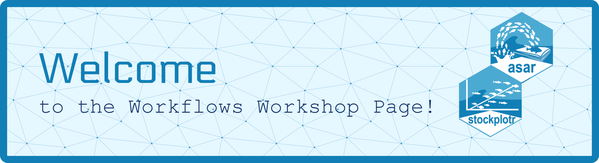

This repository houses the agenda, materials, and communication for the NOAA Fisheries Stock Assessment Workflows Workshops being held starting in 2026! Please use this README to help navigate within our repository and find out our current progress and plans in real time.

## In Progress

Currently, we are coordinating with our NOAA Fisheries Regional Science Centers to determine the best time to work with our stock assessment scientists and conduct these trainings.

## Background

The workflows of stock assessment scientists across the U.S. are highly variable and all consistently face similar issues including lack of automation, challenging data wrangling, increased requests for analyses, and more. A team with the National Stock Assessment Program at NOAA Fisheries HQ set about addressing some of these needs by identifying parts of the workflow scientsists needed help in. While there were needs to improve parts of the workflow at every step, the team and a steering committee decided to first approach the lowest hanging fruit, reporting. The goal of this project was to establish a semi-automated system for generating reports in order to reduce time completing mundane and tedious tasks that, with some effort, could be automated. From there, `asar` and `stockplotr` were built along with beginnning to estalblish a standard set of guidelines for stock assessment reports.

## System Requirements

| Program | Version |
|---------|---------|
|  | R version ? |
|  | Quarto v1.6+ |
|  | Latex from tinytex bundle-2 |

## Navigation

### Curriculum

The "curriculum" folder contains Quarto documents that we will be following through each day of the workshop. We have dedicated a lot of time already to the documentation of `asar` and `stockplotr` so we encourage everyone to visit these sites prior to the workshosps.

### Example

The "examples" folder contains multiple examples of a report produced from `asar` and `stockplotr` with varying complexities. Feel free to explore these folders and familiarize yourself with the contents generated from these two packages.

## Format

As of now, we are planning to hold a series of workshops spanning 3 days (Tuesday-Thursday) in 3 hours sessions. 

[Day 1](https://github.com/nmfs-ost/workflows-workshop/tree/main/Curriculum/Day%201): Learning the foundations of Markdown, Quarto, and the Workflow

  - Markdown
  - Quarto
  - General overview of {asar} and {stockplotr}

[Day 2](https://github.com/nmfs-ost/workflows-workshop/tree/main/Curriculum/Day%202): Introduction to `asar`

  - Basics of {asar}
  - Getting familiar
  - Customization and adding complexities to your report using {asar}

[Day 3](https://github.com/nmfs-ost/workflows-workshop/tree/main/Curriculum/Day%203): Adding Complexity and `stockplotr`

  - Guided work through of more complex {asar} example
  - Introduction to {stockplotr}
  - Integrating {asar} and {stockplotr} for a cohesive workflow

